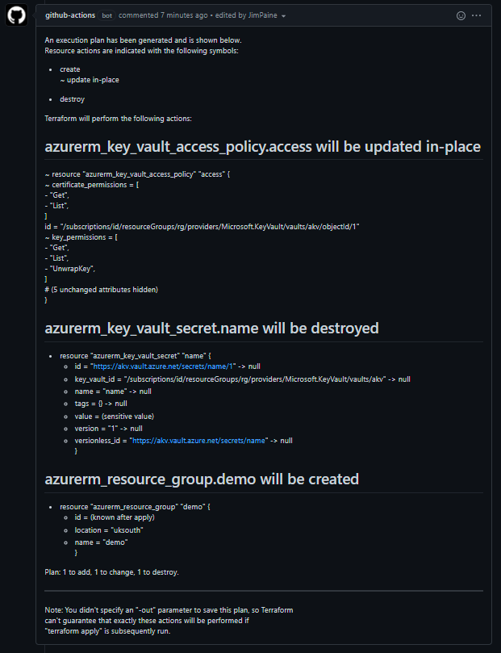

# Terraform Plan as a comment

Perform a TF plan and output the changes as a PR comment

## Need to know:

- Your workflow will need to call terraform init prior to calling this step
- This is still an early release and only some simple use cases have been tried!
- Will only work on a PR so make sure your triggers are setup
- You will still need to init your backend for state management however you were before.

## Using

```yaml
name: workflow name

on:
  pull_request:
    branches: [ main ]

jobs:
  plan:
    runs-on: ubuntu-latest

  steps:
    - name: terraform setup
      uses: hashicorp/setup-terraform@v1
    - name: terraform init
      uses: terraform init # make sure you handle the init for your backend in the appropriate way
    - name: terraform plan
      uses: jimpaine/tf-plan-as-comment@v1

```

## output

> names, urls and ids have been changed from originals and this is only to give an idea
> of what the comment will look like


